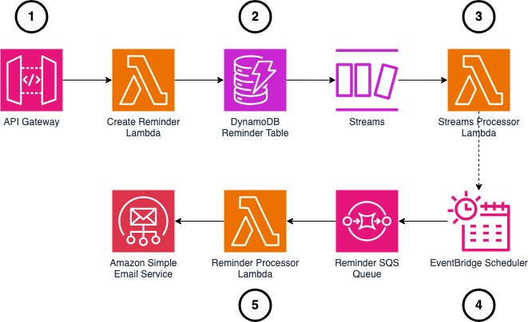

# Amazon EventBridge Scheduler and Amazon SES

We cover using Amazon EventBridge Scheduler and Amazon SES to schedule emails for customers, with examples written in the AWS CDK and Typescript.

> Note: If you choose to deploy these resources you may be charged for usage.

You can find the associated article here: https://blog.serverlessadvocate.com/scheduling-emails-through-amazon-eventbridge-scheduler-amazon-ses-c8b4442ed19d

## Architecture

We are building the following architecture in our article:

1. Our website (not built in this example) uses our Amazon API Gateway REST API to create new reminders.
2. A Lambda function creates the new reminders in our Amazon DynamoDB data store.
3. We enable DynamoDB streams which a Lambda function reads to schedule new reminder events in Amazon EventBridge Scheduler.
4. When the scheduler is invoked it pushes the events to an Amazon SQS queue, where a Lambda function reads the reminder events and sends an email to the user.

## Deploying

To deploy the solution run `npm run deploy` in the `gilmore-handbags` folder.

## Removing

To remove the solution run `npm run remove` in the `gilmore-handbags` folder.
